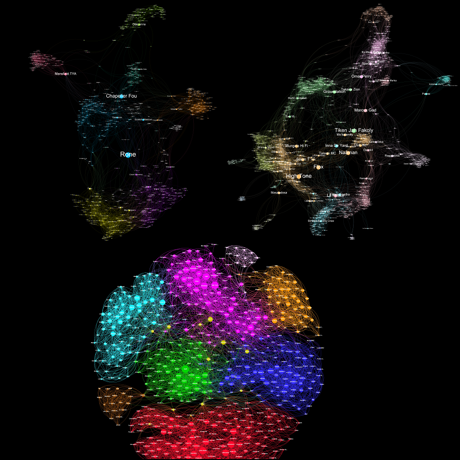

## Data_viz

Import_Native .gexf format for Gephi

All the files <em>( maybe docs in the future)</em> with all the data sets extracted via Web API Spotify for vizualization : https://developer.spotify.com/dashboard 

"int_Nodes"
 "int_Edges" type Directed
 "int_Followers"
 "int_Popularity"
 

## <strong>WARNING</strong>

Extraction results in degreeOut = 20 OR degreeOut = 0 and I don't know yet if it's the Spotify recommmendation algo OR code need debug

